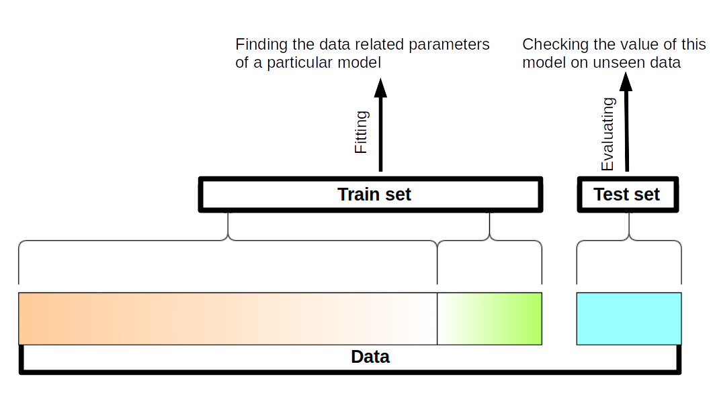
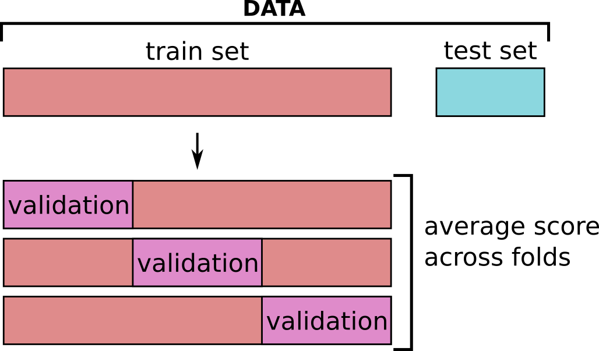

```{r setup, include=FALSE}
knitr::opts_chunk$set(echo = TRUE)
```

```{r}
library(tidyr)
library(dplyr)
library(ggplot2)
library(gridExtra)

library(tidymodels)
```

# motivating example <a id="motivation"></a>

[Acharjee et al.2016](https://bmcbioinformatics.biomedcentral.com/articles/10.1186/s12859-016-1043-4) propose several -omic dataset which they used to predict and gain knowledge on various phenotypic traits in potatos.

Here, we will concentrate on their transcriptomics dataset and the phenotypic trait of the potato coloration.

We have pre-selected and normalized the 200 most promising genes (out of ~15 000).

```{r}
file_metadata = "../data/potato_data.phenotypic.csv"
file_data = "../data/potato_data.transcriptomic.top200norm.csv"

df = read.csv( file_metadata , row.names = 1 )
dfTT = read.csv( file_data , row.names = 1 )


dfTT[ row.names(df) , "Flesh.Colour"  ] <- df[ , "Flesh.Colour"  ]  

dfTT %>% head()
```

```{r}
i1 = row.names(df)[1:73]
i2 = row.names(df)[74:nrow( df )]
```

```{r}
X = dfTT[i1 , ]
X %>% head()
```

```{r}
X$Flesh.Colour %>% summary()
```

```{r}
ggplot(dfTT , aes(x=Flesh.Colour) ) + geom_histogram()
```


## approach 1: a simple linear regression <a class="anchor" id="linear-1"></a>


We will be modelling the potato flesh color using a simple [linear model](https://en.wikipedia.org/wiki/Linear_model),
where we would write the equation of the flesh color something like:


$$flesh color = \beta_1 * E1 + \beta_2 * E2 + ... + \beta_n * En $$

Where $Ex$ is the expression level of gene $x$, and $\beta_x$ is the associated coefficient (which describes how much the expression of gene $x$ contributes to the flesh color prediction).


> It is very likely that you have already seen and manipulated linear models previously, and we are not going to develop much further here. But in case this is the first time you meet them, or you just want a refresher, here is a [jupyter notebook on linear model](https://github.com/sib-swiss/statistics-and-machine-learning-training/blob/main/01_regression_Least_Square.ipynb), from one of our other courses ;-) 


---


Let's fit a simple linear model with our gene expression values, and see what happens

```{r}

lm_fit <- linear_reg() %>% 
  fit(Flesh.Colour ~ . , data = X)


pred = ( lm_fit %>% predict( new_data = X ) )$.pred

print(paste( "R-squared score: " ,
             rsq_vec(truth = X$Flesh.Colour, estimate = pred ) ))

print(paste( "Root mean squared error: " ,
             rmse_vec(truth = X$Flesh.Colour, estimate = pred ) ))

```

```{r}
Xnew = dfTT[i2,]

pred_new = ( lm_fit %>% predict( new_data = Xnew ) )$.pred

print(paste( "R-squared score: " ,
             rsq_vec(truth = Xnew$Flesh.Colour, estimate = pred_new ) ))

print(paste( "Root mean squared error: " ,
             rmse_vec(truth = Xnew$Flesh.Colour, estimate = pred_new ) ))
```

```{r}
tmp = X %>% bind_rows( Xnew )
tmp$set = ifelse( row.names(tmp) %in% i1 , "train" , "new" )
tmp <- tmp %>% bind_cols( lm_fit %>% predict( new_data = tmp ) )

ggplot(tmp , aes(x=Flesh.Colour , y = .pred , colour = set )) +
  geom_point()
```


As expected, the performance on the new data is not as good as with the data we used to train the model.

We have **overfitted** the data.

---

Here we could still use the model that we have created, 
but we would agree that reporting the perfect performance we had with our training data would be misleading.

To honestly report the performance of our model, we measure it on a **set of data that has not been used at all to train it: the *test set*.**


To that end, we typically begin by dividing our data into :

 * **train** set : find the best model
 * **test** set  : give an honest evaluation of how the model perform on completely new data.



[Back to ToC](#toc)

## approach 2: adding regularization and validation set <a class="anchor" id="linear-2"></a>

In the case of a Least Square fit, the function you are minimizing looks like:

$\sum_i (y_i-y\_pred_i))^2$

, so the sum of squared difference between the observation and the predictions of your model.


And remember that our model is written in the following way

$$y\_pred_i = \beta_1 * X1_{i} + \beta_2 * X2_{i} + ... + \beta_n * Xn_{i} $$

---

**Regularization** is a way to reduce overfitting, and in the case of the linear model
we do so by adding to this function a **penalization term which depends on coefficient weights** (*ie*, the $\beta_x$).

In brief, the stronger the coefficient, the higher the penalization. So only coefficients which bring more fit than penalization will be kept.


> Note : we report here the formulas used in `scikit-learn` functions. Other libraries may have a different parameterization, but the concepts stay the same


$\frac{1}{2n}\sum_i (y_i-f(\pmb X_i,\pmb{\beta}))^2 + \alpha\sum_{j}|\beta_{j}|$ , **l1 regularization** (Lasso) $\alpha$ being the weight that you put on that regularization 


$\sum_i (y_i-f(\pmb X_i,\pmb{\beta}))^2 + \alpha\sum_{j}\beta_{j}^{2}$ , **l2 regularization** (Ridge) 


$\frac{1}{2n}\sum_i (y_i-f(\pmb X_i,\pmb{\beta}))^2 + \alpha\sum_{j}(\rho|\beta_{j}|+\frac{(1-\rho)}{2}\beta_{j}^{2})$ , **elasticnet**


For a deeper understanding of those notions, you may look at :

 * [datacamp tutorial](https://www.datacamp.com/community/tutorials/tutorial-ridge-lasso-elastic-net)

 * [towardsdatascience tutorial](https://towardsdatascience.com/regularization-in-machine-learning-76441ddcf99a)


> NB: Regularization generalize to maximum likelihood contexts as well)


You can see there is a **parameter $\alpha$: the regularization strength**

A small $\alpha$ will give you almost the same model as before.

A large $\alpha$ will give you a model where only a few coefficient are allowed to have a significant impact on the prediction.


Let's try that on our data:


```{r}
l1_ratio = 1.0

RSQ = c()
COEFS = NULL
log10_penalties = seq(-2,1,length.out=50)
for( log10_penalty in  log10_penalties){
  glmn_fit <- 
    linear_reg(penalty = 10**log10_penalty, 
               mixture = l1_ratio) %>% 
    set_engine("glmnet") %>%
    fit(Flesh.Colour ~ . , data = X)

  pred = ( glmn_fit %>% predict( new_data = X ) )$.pred

  RSQ = c(RSQ , rsq_vec(truth = X$Flesh.Colour, estimate = pred ) )
  
  COEFS = bind_rows( COEFS,  tidy( glmn_fit ) %>%filter(term != "(Intercept)") )
}
  

```
```{r}
p1 = ggplot( data.frame( RSQ=RSQ , log10_penalty = log10_penalties ) , aes(x=log10_penalty,y=RSQ))+geom_line()
p2 = ggplot( COEFS , aes(x=penalty,y=estimate, group = term))+geom_line() + scale_x_log10() 
grid.arrange(p1,p2, nrow=1)
```


Again with a validation set:

```{r}

split <- initial_split(X, prop = 0.7)
X_train <- training(split)
X_valid <- testing(split)

l1_ratio = 1.0

RSQ_train = c()
RSQ_valid = c()

log10_penalties = seq(-2,1,length.out=50)

for( log10_penalty in  log10_penalties){
  glmn_fit <- 
    linear_reg(penalty = 10**log10_penalty, 
               mixture = l1_ratio) %>% 
    set_engine("glmnet") %>%
    fit(Flesh.Colour ~ . , data = X_train)

  pred = ( glmn_fit %>% predict( new_data = X_train ) )$.pred
  RSQ_train = c(RSQ_train , rsq_vec(truth = X_train$Flesh.Colour, estimate = pred ) )
  
  pred = ( glmn_fit %>% predict( new_data = X_valid ) )$.pred
  RSQ_valid = c(RSQ_valid , rsq_vec(truth = X_valid$Flesh.Colour, estimate = pred ) )

}
  

dfr2 = data.frame( Rsquare= c( RSQ_train , RSQ_valid ) , 
                   log10_penalty = c( log10_penalties , log10_penalties ),
                   set = rep(c('train','valid'), each=length(log10_penalties)) )

p = ggplot( dfr2 , aes(x=log10_penalty,y=Rsquare,colour = set))+geom_line()

## best value according to validation set:
best_penalty = dfr2 %>% filter( set=='valid' ) %>% slice_max(Rsquare,n=1)
p + geom_vline(xintercept = best_penalty$log10_penalty ) +
  ggtitle( paste("best log10 penalty:", best_penalty$log10_penalty ) )
```

So now, with the help of a validation set, we can clearly see the phases :
 * **underfitting** : for high $\alpha$, the performance is low for both the train and the validation set
 * **overfitting** : for low $\alpha$, the performance is high for the train set, and low for the validation set
 
We want the equilibrium point between the two where performance is ideal for the validation set.

**Problem :** if you run the code above several time, you will see that the optimal point varies due to the random assignation to train or validation set. 

There exists a myriad of possible strategies to deal with that problem, such as repeating the above many times and taking the average of the results for instance.

> Note also that this problem gets less important as the validation set size increases.

<br>

---

<br>

Anyhow, on top of our earlier regression model, we have added :

 * an **hyper-parameter** : $\alpha$, the strength of the regularization term
 * a **validation strategy** for our model in order to avoid overfitting

<br>

That's it, we are now in the world of Machine Learning.

But before we go any further, let's see how this modified model performs on the test data:

```{r}
## fitting model
glmn_fit <- 
  linear_reg(penalty = 10**best_penalty$log10_penalty, 
             mixture = l1_ratio) %>% 
  set_engine("glmnet") %>%
  fit(Flesh.Colour ~ . , data = X)

## grouping and predicting 
tmp = X %>% bind_rows( Xnew )
tmp$set = ifelse( row.names(tmp) %in% i1 , "train" , "test" )
tmp <- tmp %>% bind_cols( glmn_fit %>% predict( new_data = tmp ) )

## computing metric
tmp %>% group_by(set)  %>% rsq( Flesh.Colour , .pred )
tmp %>% group_by(set)  %>% rmse( Flesh.Colour , .pred )

## plotting
ggplot(tmp , aes(x=Flesh.Colour , y = .pred , colour = set )) +
  geom_point()
```


##  approach 3 : k-fold cross-validation <a class="anchor" id="linear-3"></a>

In the previous approach, we have split our training data into a train set and a validation set.

This approach works well if you have enough data for your validation set to be representative.

Often, we unfortunately do not have enough data for this.

Indeed, we have seen that if we run the code above several time, we see that the optimal point varies due to the random assignation to train or validation set. 


**K-fold cross validation** is one of the most common strategy to try to mitigate this randomness with a limited amount of data.



In k-fold cross-validation

1. the data is split in $k$ subparts, called fold.
2. $k$ models are trained for each hyper-parameter values combination: each time a different fold for validation (and the remaining $k-1$ folds for training).
3. the average performance is computed across all fold : this is the **cross-validated performance**.

--- 

We are going to do a simple k-fold manually once, to explore a bit how it works, but in practice you will discover that it is mostly automatized with some of scikit-learn's recipes and objects.


```{r}
set.seed(1435)
folds <- vfold_cv(X, v = 5)
folds
```


```{r}
## we need to organize the model as a recipe or a workflow
LR_wf <- 
  workflow() %>%
  add_model( 
    linear_reg(penalty = 10**best_penalty$log10_penalty, 
               mixture = l1_ratio) %>% set_engine("glmnet") 
             ) %>%
  add_formula( Flesh.Colour ~ . )

LR_fit_res = LR_wf %>% fit_resamples(folds)

collect_metrics(LR_fit_res)
```
```{r}
collect_metrics(LR_fit_res , summarize = FALSE)
```

```{r}

LR_wf <- 
  workflow() %>%
  add_model( 
    linear_reg(penalty = tune(),  ## penalty is set as tune()
               mixture = l1_ratio) %>% set_engine("glmnet") 
             ) %>%
  add_formula( Flesh.Colour ~ . )

## prepare the grid of hyper-parameter values to test:
LR_grid <- grid_regular(penalty(range = c(-2,1) ),
                          levels = 50)
LR_grid %>% head()
```
```{r}
LR_grid$penalty %>% summary()
```


```{r}
LR_res <- 
  LR_wf %>% 
  tune_grid(
    resamples = folds,
    grid = LR_grid
    )

LR_metric <- LR_res %>% collect_metrics() 
LR_metric %>% head()
```

```{r}
ggplot( LR_metric %>% filter(.metric == 'rsq'), aes(x = penalty , y=mean)) + 
  geom_line() +
  geom_ribbon(aes(ymin = mean - std_err,
                  ymax = mean + std_err),
              fill = 'gray' , alpha = 0.5) +
  scale_x_log10()
```

```{r}
LR_res %>%
  show_best(metric = "rsq")
```

```{r}
best_model <- LR_res %>%
  select_best(metric = "rsq")
best_model
```

---

## big recap


```{r}
split <- initial_split(dfTT, prop = 0.7)
X_train <- training(split)
X_test  <- testing(split)
```


```{r}
# we add a normalization step, so we need a recipe:
LR_recipe <- recipe( Flesh.Colour ~ . , data = X_train) %>%
  step_normalize(all_predictors())

LR_model <- linear_reg(penalty = tune(),  
                       mixture = tune()) %>% 
  set_engine("glmnet") 

LR_wf <- 
  workflow() %>%
  add_model( LR_model ) %>%
  add_recipe( LR_recipe )

## prepare the grid of hyper-parameter values to test:
LR_grid <- grid_regular(penalty(range = c(-2,3) ),
                        mixture(),
                          levels = 50)

## Cross-Validation setup
folds <- vfold_cv(X_train, v = 5)


LR_res <- 
  LR_wf %>% 
  tune_grid(
    resamples = folds,
    grid = LR_grid,
    metrics = metric_set( rsq, mae )
    )
```

```{r}
LR_metrics <- LR_res %>% collect_metrics() %>% filter(.metric == "mae")
ggplot(LR_metrics, aes( x= penalty, y=mixture, fill= mean)) + 
  geom_tile() + scale_x_log10() + scale_fill_distiller("spectral")
```


```{r}
LR_res %>% 
  show_best(metric = "rsq", n = 5)
```

```{r}
best_model <- LR_res %>% select_best(metric = "rsq")
best_model
```
```{r}
final_wf <- 
  LR_wf %>% 
  finalize_workflow(best_model)

final_wf
```
```{r}
final_fit <- 
  final_wf %>%
  last_fit(split) 

final_fit %>%
  collect_metrics()
```

```{r}
test_predictions = final_fit %>% collect_predictions()
ggplot(test_predictions , aes(x=Flesh.Colour , y = .pred)) + geom_point()
```

```{r}
final_LR <- extract_workflow(final_fit)

## extract model coefficients and display the 10 with the highest absolute coefficient
tidy( final_LR ) %>% filter(term != "(Intercept)") %>% 
  mutate( coef_abs = abs(estimate) ) %>% 
  arrange( desc( coef_abs ) ) %>%
  head(n=10)
```


