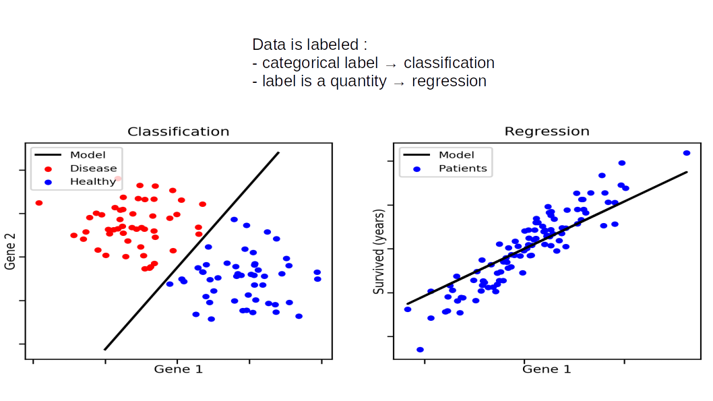
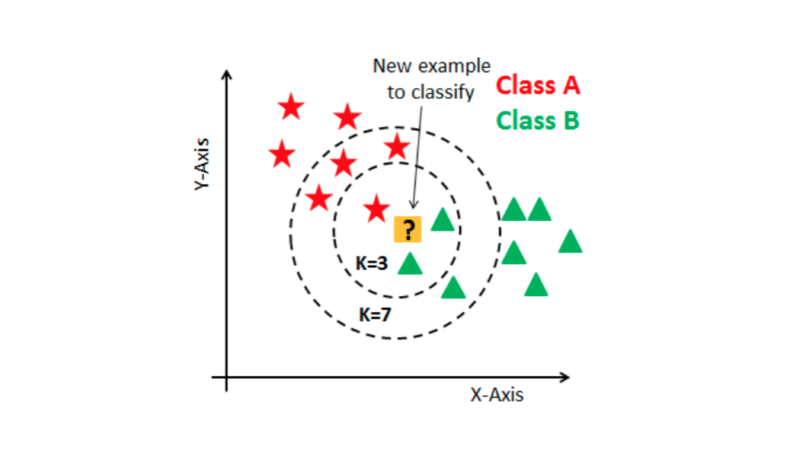
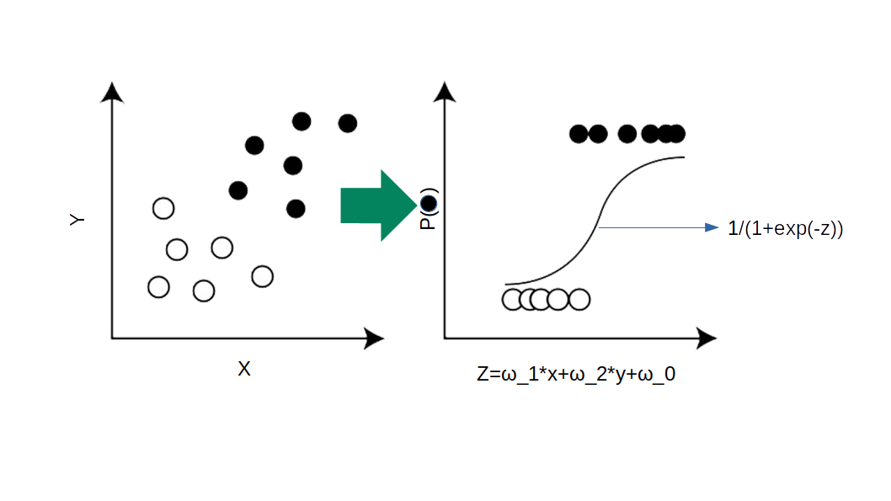

```{r setup, include=FALSE}
knitr::opts_chunk$set(echo = TRUE)
```

In this chapter we will **only talk about classification**. Classifiers associate a transformed set of features to a set of classes (a discrete variable)



In this notebook we are going to focus on distance based classification method (opposed to decision tree for example wich works with threshold more than actual distances). The goal is to give you some insight on 4 different levels: - **Best practices** - **Intuition on the concepts behind those methods** - **How to implement them with Scikitlearn** - **Intuition on the different parameters that your model need but are not trainable (hyperparameters)**

```{r}
library(tidyr)
library(dplyr)
library(ggplot2)
library(gridExtra)
library(pheatmap)

library(tidymodels)
library(vip)

library(themis)

## also requires:
# * kknn

```

# Meet the data <a id='data'></a>

## Binary class dataset : breast cancer <a id="data-cancer"></a>

In the cancer dataset you have 569 tumors for which many features have been measured. The goal is to predict if the tumor is malignant or not.

```{r}
BreastCancer <- read.csv("../data/breast_cancer.csv")

# IMPORTANT: ensure the "label of interest" is the first level of the factor !
BreastCancer$malignant = factor( BreastCancer$malignant , levels = c(1,0))


BreastCancer %>% head()
```

Columns are:

-   **mean.radius** : average cell radius
-   **mean.texture** : average cell texture metric
-   **mean.perimeter** : average cell perimeter
-   **mean.area** : average cell area
-   **mean.smoothness** : average cell smoothness metric
-   **mean.compactness** : average cell compactness metric
-   **mean.concavity** : average cell concavity metric
-   **mean.concave.points** : average cell concavity metric
-   **mean.symmetry** : average cell symmetry
-   **mean.fractal.dimension** : average cell fractal dimension
-   **malignant** : benign (0) or malignant (1)

```{r}
table( BreastCancer$malignant  )
```

So, there is a slight over-representation of benign tumors.

```{r}
cor_matrix = cor( BreastCancer[ , -11], method = "pearson" )
palette <- colorRampPalette(c("blue","white","red"))(100)
pheatmap(cor_matrix,
         display_numbers = TRUE,
          color=palette, breaks=seq(-1,1,length.out=100))
```

So it looks some of these features are extremely correlated, so we may drop some of the most egregious cases

```{r}
BreastCancer <- BreastCancer %>% select( !c(mean.area,mean.perimeter,mean.concave.points)  ) 

```

# K-nearest neighbors + some basic routine <a class="anchor" id="neighbors"></a>

K-nearest neighbors is a pretty simple algorithm in terms of concept but it already has few hyperparameters that you should understand and try to optimize. It will introduce you to some of the very experimental like routine that machine learning is.

For a classifier, k-nearest neighbors works as follow.

**First the algorithm simply saves the labels that it is given during the training phase**.

Then during the testing phase it takes a testing point and checks its `n_neighbors` nearest neighbors.

**If `n_neighbors` nearest neighbors are mostly (in majority) from one label then the tested point will be assigned this label**.

The way the `n_neighbors` **nearest neighbors vote** can be either

-   uniform (every point as the same importance in the vote) or,
-   distance-based (a point distant to the tested point by a distance d will have a weight of 1/d in the vote).



[Image from datacamp tutorials](https://www.datacamp.com/community/tutorials/k-nearest-neighbor-classification-scikit-learn)

[Back to the ToC](#toc)

### Toy dataset: KNN concepts and hyperparameters<a class="anchor" id="KN-concepts"></a>

```{r}
set.seed(123)
blob1 = data.frame( x = rnorm(30 , mean = -7 ),
                    y = rnorm(30 , mean = 2.5 , sd = 3 ),
                    label = '1')
blob2 = data.frame( x = rnorm(30 , mean = 6 ),
                    y = rnorm(30 , mean = -6 , sd = 3 ),
                    label = '2')
blob3 = data.frame( x = rnorm(30 , mean = 8 ),
                    y = rnorm(30 , mean = -3 , sd = 3 ),
                    label = '3')
blobs <- bind_rows( blob1 , blob2, blob3)
blobs <- blobs %>% mutate( label = as.factor(label) )

ggplot(blobs, aes(x=x,y=y,col=label)) + geom_point()
```

fitting a KNN classifier with tidymodel looks like this:

```{r}
# https://parsnip.tidymodels.org//reference/nearest_neighbor.html
KNN = nearest_neighbor(neighbors = 5, mode = 'classification') %>% 
  fit( label ~ . , data = blobs)

pred <- KNN %>% predict(new_data = blobs)

table( blobs$label , pred$.pred_class ) 
```

Let's look at the effect of the number of neighbors:

```{r}
contour_KNN <- function(K,data,...){
# Make a grid to predict the whole space:
grid <-
  crossing(
    x = seq(-12, 12, length.out = 250),
    y = seq(-12, 12, length.out = 250)
  )
KNN = nearest_neighbor(neighbors = K, 
                       mode = 'classification',...) %>% 
  fit( label ~ . , 
       data = data)

grid$knnres <- bind_cols(predict(KNN, grid))$.pred_class

return(  ggplot(grid, aes(x = x, y = y)) +
         geom_contour_filled(aes(z = as.numeric(knnres)) ,
                             breaks=c(0.5,1.5,2.5,3.5))+
         geom_point(data = blobs , aes(x=x,y=y,col=label)) +
         ggtitle(paste("number of neighbors: ",K)) )
  
}

contour_KNN(1,blobs)
```

```{r}
contour_KNN(5,blobs)
```

```{r}
contour_KNN(89,blobs)
```

In the above we varied the number of voters (neighbors) to decide whether a point is from one class or another.

You can see how the **boundaries are way more wiggly and attentive to missclassification when the number of neighbors is low**.

But you can also imagine that if **new data is added it is likely to be missclassified** with those kind of too specific boundaries.

Conversely, when the number of neighbors is very high (120 here), then the **model is not sensitive to point placement**.

This is a first example of the **bias variance trade off.**

We say that:

-   the model with k=1 has a **high variance**
-   the model with k=89 has a **high bias**

------------------------------------------------------------------------

Another parameter is **how voting is done**.

This is controled by the `weight_func` argument which defines a *kernel* weighting neighbors according to their distances.


image source: wikipedia user Brian Amberg

Choices here are:

 * `"rectangular"` (which is standard unweighted knn)
 * `"triangular"`
 * `"epanechnikov"` (or beta(2,2))
 * `"biweight"` (or beta(3,3)), 
 * `"triweight"` (or beta(4,4)), 
 * `"cos"`
 * `"gaussian"`
 * `"inv"`
 * `"optimal"` : the default, a weighting scheme which accounts for the number of input dimensions ([Samworth 2012](https://projecteuclid.org/journals/annals-of-statistics/volume-40/issue-5/Optimal-weighted-nearest-neighbour-classifiers/10.1214/12-AOS1049.full))


```{r}
contour_KNN(3,blobs , weight_func = 'rectangular')
```

```{r}
contour_KNN(3,blobs , weight_func = 'triangular')
```


Do you see what changed?

So here, connecting this to the previous chapter: K and the weighting, which govern our model bias-variance tradeoff and cannot be set directly from the data are **hyper-parameters** of the KNN algorithm.

There are many additional hyper-parameters we could consider as well:

-   the imputation strategy
-   the normalization strategy
-   dimensionality reduction : how many PCA axes do I keep?
-   choice of the classification algorithm (KNN, logistic regression, ranfom forest, neural network, ...)

...


### A metric to score classification : accuracy

One straight forward metric to evaluate our model is the accuracy. Accuracy is only interesting on the test set, even though it can give you some good insight about your model when accuracy is compared between test and training set.

But again, the main thing that is going to matter to evaluate your model concern metric evaluated on the test set.

Accuracy is defined as follow : $\frac{TP+TN}{P+N}$

-   TP : True Positive
-   TN : True Negative
-   FP : False Positive
-   FN : False Negative
-   P : Positive : $P=TP+FN$
-   N : Negative : $N=TN+FP$


In code, we can compute it from a data.frame with the `accuracy` function,
and with `accuracy_vec` if we have two vectors:


```{r}
example = data.frame( truth = as.factor(c(0,0,0,1,1,1)),
                      pred  = as.factor(c(0,0,1,0,1,1))
)
# 2 errors out of 6 predictions

example %>% accuracy( truth , pred )
```
```{r}
accuracy_vec( example$truth , example$pred )
```


### finding the best hyper-parameter set with KNN

We implement here the procedure we have seen with the potato dataset in the previous chapter :

**But** we will have to adapt a few things.

First during the train/test split, we use the `strata` argument to ensure that we have the same proportion of each class in the train and the test set.


```{r}
split <- initial_split(blobs, prop = 0.7 , strata = label)
X_train <- training(split)
X_test  <- testing(split)
```

```{r}
table( X_train$label )
```

```{r}
table( X_test$label )
```

Then we proceed with the hyper-parameter optimization.

**But** (there's always a but), we need to change the metric we are optimizing.

Before we were optimizing for $R^2$, which appropriate for regression tasks, but now we will switch it for **accuracy**.


**micro-exercise:** Change the code below so the tuning :

 * operates on accuracy instead of $R^2$.
 * explores hyper-parameters of the KNN (*hint: look at the documentation for [grid_regular](https://dials.tidymodels.org/reference/grid_regular.html)*):
     * `weight_func` : try rectangular, triangular, and optimal
     * `neighbors` : can take values between 1 and 30

```
# we add a normalization step, so we need a recipe:
blobs_recipe <- recipe( label ~ . , data = X_train) %>%
  step_normalize(all_predictors())

blobs_model <- nearest_neighbor(neighbors = tune(),
                              weight_func = tune(),
                              mode = 'classification')

blobs_wf <- 
  workflow() %>%
  add_model( blobs_model ) %>%
  add_recipe( blobs_recipe )

## prepare the grid of hyper-parameter values to test:
blobs_grid <- grid_regular( ... ) ## setup the hyper parameters here

## Cross-Validation setup
folds <- vfold_cv(X_train, v = 5)


blobs_res <- 
  blobs_wf %>% 
  tune_grid(
    resamples = folds,
    grid = blobs_grid,
    metrics = ... ## add the proper score here
    )
```

correction :

```{r}
# we add a normalization step, so we need a recipe:
blobs_recipe <- recipe( label ~ . , data = X_train) %>%
  step_normalize(all_predictors())

blobs_model <- nearest_neighbor(neighbors = tune(),
                              weight_func = tune(),
                              mode = 'classification') 

blobs_wf <- 
  workflow() %>%
  add_model( blobs_model ) %>%
  add_recipe( blobs_recipe )

## prepare the grid of hyper-parameter values to test:
blobs_grid <- grid_regular( neighbors(range = c(1,30)) , 
                            weight_func( values = c('rectangular',
                                                    'triangular',
                                                    'optimal')),
                            levels = 30)

## Cross-Validation setup
folds <- vfold_cv(X_train, v = 5)


blobs_res <- 
  blobs_wf %>% 
  tune_grid(
    resamples = folds,
    grid = blobs_grid,
    metrics = metric_set( accuracy )
    )
```


```{r}
blobs_metrics <- blobs_res %>% collect_metrics()

ggplot(blobs_metrics, aes( x = neighbors , y = mean , color = weight_func)) + 
  geom_line()
```


```{r}
blobs_res %>% 
  show_best(metric = "accuracy", n = 5)
```

```{r}
best_model <- blobs_res %>% select_best(metric = "accuracy")
best_model
```
```{r}
final_wf <- 
  blobs_wf %>% 
  finalize_workflow(best_model)

final_fit <- 
  final_wf %>%
  last_fit(split) 

final_fit %>%
  collect_metrics()
```

We see that on top of accuracy, yardstick also computes by default the :

 * ROC AUC : area under the ROC curve (more on that later)
 * brier score: equivalent to MSE for classification, the best value is 0

```{r}
test_predictions = final_fit %>% collect_predictions()
test_predictions %>% head()
```
```{r}
table( test_predictions$.pred_class  , test_predictions$label )
```


Note here that the test set very small size (only 10 points per category) which gives us a very **coarse grained estimate of test accuracy**.

> You can read more on this subject in this [blog post](https://www.r-bloggers.com/2021/01/what-is-a-good-test-set-size/).


### important considerations: leakage

The **test set should never be touched until the last step which is the model evaluation**.

By doing so we can be confident that our evaluation of the **ability of our model to generalize to new data** is as fair as it can be.

We say that no information coming from the test set should leak into the train set. If this is the case, we are biasing our understanding of the generalizability of our model.

To avoid **leakage** you should ensure your test set is absent from even the early stages of your pipeline, such as imputation or feature selection (so you have guessed it, most of the operations we have done until now have lead to leakage...).


## applying all this to the cancer dataset

**We first divide our data into a train and a test set:**


```{r}
split <- initial_split(BreastCancer, strata = malignant)
BC_train <- training(split)
BC_test  <- testing(split)

print( paste('train:',nrow( BC_train ) ) )
print( paste('test :',nrow( BC_test ) ) )
```


```{r}
breast_recipe <- recipe( malignant ~ . , data = BC_train) %>%
  step_normalize(all_predictors())

breast_model <- nearest_neighbor(neighbors = tune(),
                              weight_func = tune(),
                              mode = 'classification') 

breast_wf <- 
  workflow() %>%
  add_model( breast_model ) %>%
  add_recipe( breast_recipe )

## prepare the grid of hyper-parameter values to test:
breast_grid <- grid_regular( neighbors(range = c(1,30)) , 
                             weight_func( values = c('rectangular',
                                                     'triangular',
                                                     'optimal')),
                             levels = 30)

## Cross-Validation setup
folds <- vfold_cv(BC_train, v = 5)


breast_KNN_res <- 
  breast_wf %>% 
  tune_grid(
    resamples = folds,
    grid = breast_grid
    )
```

```{r}
breast_KNN_res %>% 
  show_best(metric = "accuracy", n = 5)
```


Do accuracy and ROC AUC coincide?

```{r}
tmp = breast_KNN_res %>% collect_metrics(type='wide')
ggplot(tmp, aes(x=accuracy,y=roc_auc)) + geom_point()
```
```{r}
breast_KNN_res %>% 
  show_best(metric = "roc_auc", n = 5)
```

```{r}
tmp = breast_KNN_res %>% collect_metrics() %>% filter( .metric != "brier_class"  )
ggplot( tmp , aes(x=neighbors , y = mean , col=.metric , lty=weight_func ) ) + geom_line()
```

So there it is: we have applied cross-validation to explore the space of hyper-parameters and we have gotten hyper-parameter values that provide a good bias-variance trade-off.

------------------------------------------------------------------------
**Important note:**

But, before we go to the next part, there is one important thing we forgot in this pipeline: like PCA or KMeans, the **KNN algorithm relies on distances** between points.

Meaningful distances can only be computed if all features follow a comparable scale, which is not the case in our cancer dataset:

```{r}
BreastCancer %>% head()
```
The implementation of KNN that tidymodels relies on does normalization by default, but:

1. this may not be the case in other models/implementations
2. sometimes normalization others than the simple "center and scale" are more relevant

That is why I tend to still put an explicit `step_normalize(all_predictors())` in the recipe.


### A few important points

-   instead of a regular grid of hyper-parameter values, we can explore [random values](https://dials.tidymodels.org/reference/grid_regular.html). 
-   K-fold Cross-Validation is ihnerently stochastic, it is common to repeat it many times (see the `repeats` argument of `vfold_cv()`)
-   Accuracy is not always the most appropriate metric (but more on that later...)


# Logistic regression

**The main hypothesis of logistic regression is that the log odds ratio of the probability that a point is part of a certain class follows a linear combination of the features describing this point.** This is equivalent to the assumption that the two classes are linearly separable and that the log odds ratio increases linearly with the distance from the separating line.

Let's say you only have two classes and so your target variable can only take two values $y_{i} \in\{1,0\}$. Let's define $p(\pmb{x})=P(y=1)$ the probability than your datapoint $\pmb{x}$ belongs to class 1. Let's also say that you have $M$ features to describe a point $\{\pmb{x}_{i}\}_{i=1,...,M}$. And that you have N points.

Then we make the hypothesis that:

$log{\frac{p}{1-p}}=w_{0}+\Sigma^{M}_{i=1}w_{i}x_{i}=w_{0}+\pmb{x}\cdot\pmb{w}$

which translates to

$p(\pmb{x}|y=1)=\frac{1}{1+e^{-(w_{0}+\pmb{x}\cdot\pmb{w})}}$



**So the probability that your datapoint is in class 1 is the logistic function (sigmoid) applied to the linear combination of features.** The larger the weights $\pmb{w}$ the steeper the change between the two classes. The values of $\pmb{w}$ are stored by the 'coeff\_' attribute of the [sklearn.linear_model.LogisticRegression](https://scikit-learn.org/stable/modules/generated/sklearn.linear_model.LogisticRegression.html#sklearn.linear_model.LogisticRegression) class. $w_{0}$ is stored in 'intercept\_'. The function 'decision_function($\pmb{x}$)' returns $w_{0}+\pmb{x}\cdot\pmb{w}$ and 'predict_proba($\pmb{x}$)' returns $p(\pmb{x}|y=1)$ and $p(\pmb{x}|y=0)$

Unlike KNN the logistic regression model provides valuable information on the importance of features for the classification. The bigger the absolute value of the weight $w_{i}$ associated with a feature, the more important this feature is to discriminate between your classes (supposed that features are normalized and mapped onto a similar scale).

Fitting a logistic regression model corresponds to optimizing the loss function

$\pmb{w},w_{0}=argmin_{\pmb{w},w_{0}}\mathcal{L}(\pmb{w},w_{0},\pmb{X},\pmb{y})$ <br><br> $\mathcal{L}(\pmb{w},w_{0},\pmb{X},\pmb{y})=\Sigma^{N}_{i=1}y_{i}\log(p(\pmb{x}_i|y=1))+(1-y_{i})\log(p(\pmb{x}_i|y=0))$

So, now the way we get the w is from fitting our distribution of probability that a point is in class 1. If the number of features is high and there is a significant amount of non-informative features, the fitting procedure can become unstable. What happens is that some weights of non-informative features may become very large in order to minimize the loss function on the training data, which may lead to reduced performance on the test data (overfitting).

In order to avoid this situation we can add a penalty to the loss function that avoids that weights $w_{i}$ become too large. In ML three such penalties are commonly used:

$\mathcal{L}(\pmb{w},w_{0},\pmb{X},\pmb{y}) + \frac{1}{C}\Sigma^{N}_{i=1}|w_{i}|$ , l1 regularization (Lasso) C being the inverse of the weight that you put on that regularization

$\mathcal{L}(\pmb{w},w_{0},\pmb{X},\pmb{y}) + \frac{1}{C}\Sigma^{N}_{i=1}w_{i}^{2}$ , l2 regularization (Ridge)

$\mathcal{L}(\pmb{w},w_{0},\pmb{X},\pmb{y}) + \frac{1}{C}\Sigma^{N}_{i=1}(\alpha|w_{i}|+(1-\alpha)w_{i}^{2})$ , elasticnet

For a deeper understanding of those notions :

-   <https://www.datacamp.com/community/tutorials/tutorial-ridge-lasso-elastic-net>

-   <https://towardsdatascience.com/regularization-in-machine-learning-76441ddcf99a>

-   **L1 (lasso)** regularization produces many zero weights. It is useful for the case where you suspect that only a few features are informative.

-   **L2 (ridge)** regularization leads to many features with small, but non-zero weights.

The L1 regularization may have more bias, and the L2 more variance.

The elasticnet interpolates between these two situations at the cost of having and additional parameter $\alpha$.

```{r}
recipe_radius <- recipe( malignant ~ mean.radius + mean.symmetry , 
                         data = BC_train) %>%
  step_normalize(all_predictors())


mock_data = data.frame( mean.radius = seq( -25,
                                           50,
                                           length.out=100),
                        mean.symmetry= mean( BC_train$mean.symmetry ))

for(P in c(0.01,0.1,0.5)){
  LR <- logistic_reg( mode = "classification",
                      engine = "glmnet",
                      penalty = P,
                      mixture = 0 )

  radius_wf <- workflow() %>%
    add_model( LR ) %>%
    add_recipe( recipe_radius ) %>% 
    fit( data = BC_train  )
  
  mock_data[ paste0('pred_',P)  ] <- (radius_wf %>% predict( mock_data , 
                                                     type='prob'  ))$.pred_1 
  
}


mock_data_long <- pivot_longer(mock_data, 
                               3:5 , 
                               names_to ="penalty" , values_to = 'proba' ) 

ggplot(mock_data_long , aes( x = mean.radius , y = proba , col = penalty ) ) +
  geom_line()

```

## logistic regression on the breast cancer dataset


```{r}
breast_recipe <- recipe( malignant ~ . , data = BC_train) %>%
  step_normalize(all_predictors())

breast_model <- logistic_reg( mode = "classification",
                      engine = "glmnet",
                      penalty = tune(),
                      mixture = tune() )

breast_wf <- 
  workflow() %>%
  add_model( breast_model ) %>%
  add_recipe( breast_recipe )

## prepare the grid of hyper-parameter values to test:
breast_grid <- grid_regular( penalty(range=c(-5,2), 
                                     trans = transform_log10()) , 
                             mixture(range = c(0, 1)),
                             levels = c(50,11))

breast_LR_res <- 
  breast_wf %>% 
  tune_grid(
    resamples = folds,
    grid = breast_grid
    )
```

```{r}
breast_LR_res %>% 
  show_best(metric = "accuracy", n = 5)
```


```{r}
breast_LR_res %>% 
  collect_metrics(type='wide') %>% 
  arrange( desc( accuracy )  ) %>%
  select( !.config ) %>%
  head()
```

We could now compare this to the best KNN classifier we obtained:
```{r}
breast_KNN_res %>% 
  collect_metrics(type='wide') %>% 
  arrange( desc( accuracy )  ) %>%
  select( !.config ) %>%
  head( n = 3 )
```

It looks like cross-validated performance of both models are very similar here.

Let's check how the logistic regression actually discriminates the two classes with the code below.

Or said differently : **what can we learn from our model**, apart from pure classification?

In logistic regression the importances are derived from the model coefficients.
We could extract them manually, but alternatively the `vip` (**v**ariable **i**mportance **p**lots) can help us.

```{r}
## choose a combination of hyperparameter
best_model <- breast_LR_res %>% select_best(metric = "accuracy")

final_LR <- breast_wf %>% 
  finalize_workflow(best_model) %>% # apply hyper-parameters
  last_fit(split) %>%               # fit with the train data
  extract_workflow(final_fit)       # extract the workflow


final_LR %>% 
  extract_fit_parsnip() %>% 
  vip()
```


## Imbalanced dataset and alternative metrics

Let's use a small example where we have 300 points in one class, and 30 in the other:

```{r}
set.seed(123)
make2blobs = function(n1,n2){
  blob2 = data.frame( x = rnorm(n1 , mean = 6 ),
                      y = rnorm(n1 , mean = -3 , sd = 3 ),
                      label = 'B')
  blob3 = data.frame( x = rnorm(n2 , mean = 8 ),
                      y = rnorm(n2 , mean = -3 , sd = 3 ),
                      label = 'A')
  blobs2 <- bind_rows(  blob2, blob3)
  return( blobs2 %>% mutate( label = as.factor(label) ) )
}

blobs2 = make2blobs(300,30)

ggplot(blobs2, aes(x=x,y=y,col=label)) + geom_point()
```

```{r}
recipe_b2 <- recipe( label ~. , data = blobs2) %>%
  step_normalize(all_predictors())

mock_data = data.frame( x = seq( 0,10,length.out=100),
                        y = -3)

for(P in c(0.01,0.1,1)){
  LR <- logistic_reg( mode = "classification",
                      engine = "glmnet",
                      penalty = P,
                      mixture = 0 )

  blobs2_wf <- workflow() %>%
    add_model( LR ) %>%
    add_recipe( recipe_b2 ) %>% 
    fit( data = blobs2  )
  
  mock_data[ paste0('pred_',P)  ] <- (blobs2_wf %>% predict( mock_data , 
                                                     type='prob'  ))$.pred_A
  
}


mock_data_long <- pivot_longer(mock_data, 
                               3:5 , 
                               names_to ="penalty" , values_to = 'proba' ) 

ggplot(mock_data_long , aes( x = x , y = proba , col = penalty ) ) +
  geom_line()

```

You can see that now the point where the probability curves for different alpha converge is not even close to 0.5.

Also, the probability says fairly low even at the right end of the plot.


```{r}
blob_fit = function(data , penalty){

  LR <- logistic_reg( mode = "classification",
                        engine = "glmnet",
                        penalty = penalty,
                        mixture = 0 )
  
  fit <- LR %>%
      fit( label ~ . , data = data  )

  return(fit)
}

truth = blobs2$label
pred  = ( blob_fit(blobs2 , 0.01 )  %>% predict( blobs2 ) )$.pred_class

print(paste('accuracy:',accuracy_vec(truth , pred)))
conf_mat( table( truth , pred ) )
```


So, most of the class A samples are miss-classified (22/30), but we still get a very high accuracy...

That is because, by contruction, both the **logistic regression and accuracy score do not differentiate False Positive and False Negative**.

And the problem gets worse the more imbalance there is :

```{r}
n2_ratio = c()
ACC = c()
RECALL = c() ## RECALL = TP / (TP + FN)

for( n2 in seq(5,300,5) ){
  blobs2 = make2blobs(300,n2)
  
  truth = blobs2$label
  pred  = ( blob_fit(blobs2 , 0.01 )  %>% predict( blobs2 ) )$.pred_class
  
  n2_ratio = c(n2_ratio,n2/300)
  ACC = c(ACC, accuracy_vec(truth , pred))
  RECALL = c(RECALL,recall_vec(truth , pred ))

}

tmp = data.frame( n2_ratio = n2_ratio , 
                  accuracy = ACC,
                  recall = RECALL ) %>% pivot_longer( 2:3 , 
                                                      names_to = 'metric',
                                                      values_to = 'value')

ggplot(tmp , aes(x=n2_ratio,y=value , col=metric)) + geom_line()
```


```{r}

n2_ratio = c()
acc = c()
rec = c()
bal_acc = c()
f1 = c()

for( n2 in seq(5,300,5) ){
  blobs2 = make2blobs(300,n2)
  
  truth = blobs2$label
  pred  = ( blob_fit(blobs2 , 0.01 )  %>% predict( blobs2 ) )$.pred_class

  n2_ratio = c(n2_ratio,n2/300)
  acc = c(acc, accuracy_vec(truth , pred))
  rec = c(rec,recall_vec(truth , pred))
  bal_acc = c(bal_acc, bal_accuracy_vec(truth , pred))
  f1 = c(f1,f_meas_vec(truth , pred))

  
  
}

tmp = data.frame( n2_ratio , acc, rec, bal_acc,f1 ) %>% pivot_longer( 2:5 , 
                                                      names_to = 'metric',
                                                      values_to = 'value')

ggplot(tmp , aes(x=n2_ratio,y=value , col=metric)) + geom_line()
```


### setting the event of interest

Some metrics like specificity, recall, f1 score, or ROC AUC are dependent on the label of interest.

By default, these functions consider the first level of the target factor as the label of interest.

You can change this with the `event_level` argument:

```{r}
blobs2 = make2blobs(300,30)

truth = blobs2$label

pred  = ( blob_fit(blobs2 , 0.01 )  %>% predict( blobs2 ) )$.pred_class

print(paste('recall class A:',recall_vec(truth , pred , event_level = 'first')))
print(paste('recall class B:',recall_vec(truth , pred , event_level = 'second')))

conf_mat(table(truth,pred))
```

### remedy1: case weight

Some methods and metrics allow you to re-weight the different data points can influence them.

By giving a higher importance to point of a given class, we can bias our model toward that class.

If we do this by giving more importance to the rarer class and less to the more frequent, we can *correct* the imbalance bias.

This is similar to indicating to our model that making error with the rare class cost more than doing error with the frequent class.

```{r}
blobs2 = make2blobs(300,30)

## weighting them by the inverse of their frequency
wgtA = 1/30
wgtB = 1/300

blobs2 <- blobs2 %>%
  mutate(
    case_wts = ifelse(label == "A", wgtA,  wgtB),
    case_wts = importance_weights(case_wts)
  )


lr_spec <- 
  logistic_reg(penalty = 0.01, mixture = 0) %>% 
  set_engine("glmnet")

recipe_b2 <- recipe( label ~. , data = blobs2) %>%
  step_normalize(all_predictors())

lr_wflow <- 
  workflow() %>% 
  add_model(lr_spec) %>% 
  add_recipe(recipe_b2) %>%
  add_case_weights(case_wts)
  
lr_wflow <- lr_wflow %>% fit( blobs2)

truth = blobs2$label
pred  = ( lr_wflow  %>% predict( blobs2 ) )$.pred_class

print(paste('accuracy:',accuracy_vec(truth , pred)))
print(paste('balanced accuracy:',bal_accuracy_vec(truth , pred)))
print(paste('recall class A:',recall_vec(truth , pred , event_level = 'first')))
print(paste('recall class B:',recall_vec(truth , pred , event_level = 'second')))
conf_mat( table( truth , pred ) )
```


### remedy2: subsampling

```{r}
blobs2 = make2blobs(3000,30)

recipe_b2 <- recipe( label ~. , data = blobs2) %>%
  step_rose(label) # alternative: step_upsample(), step_downsample(), ...

lr_spec <- 
  logistic_reg(penalty = 0.01, mixture = 0) %>% 
  set_engine("glmnet")

cv_folds <- vfold_cv(blobs2, strata = "label", repeats = 5, v = 5)
cls_metrics <- metric_set(accuracy,
                          bal_accuracy,
                          recall,
                          metric_tweak("recall_second", recall , event_level='second')
                          )

lr_wflow <- 
  workflow() %>% 
  add_model(lr_spec) %>% 
  add_recipe(recipe_b2)

lr_res <- fit_resamples(
  lr_wflow, 
  resamples = cv_folds, 
  metrics = cls_metrics
)

collect_metrics(lr_res)
```

```{r}
lr_wflow <- 
  workflow() %>% 
  add_model(lr_spec) %>%
  add_formula(label ~ .)

lr_res <- fit_resamples(
  lr_wflow, 
  resamples = cv_folds, 
  metrics = cls_metrics
)

collect_metrics(lr_res)
```


### ROC curve

```{r}
n2=30
blobs2 = make2blobs(300,n2)
fit = blob_fit(blobs2 , 0.01 )

blobs_roc_curve <- fit %>% predict( blobs2 , type='prob' ) %>%
  mutate(truth = blobs2$label ) %>%
  roc_curve(truth , .pred_A)

blobs_roc_curve
```
```{r}
blobs_roc_curve %>% autoplot()
```

```{r}
blobs_roc_curve[ which(blobs_roc_curve$.threshold >= 0.5)[1] , ]
```

### muliclass context

Many of the models and metrics base definition are based on a binary context (0/1, control/treatment, benign/malignant), and sometimes on a single specific category of interest (recall, roc auc, f1,...).

But often we are in context where we have more than two categories to consider.

```{r}
cat = rep(c(1,2,3),c(60,30,10)) 
blobs = data.frame( x = rnorm( 100  ) + cat,
                    y = rnorm( 100  ) + c(0,1,0)[cat],
                    label = as.factor(cat)
)
ggplot(blobs , aes(x=x,y=y,col=label)) + geom_point()
```

To start off, some models are just inadapted, such as the logistic regression:

```{r}
LR <- logistic_reg( engine = 'glm' ) %>%
  fit( label ~ . , data = blobs  )

table( LR %>% predict(blobs ) )
```

KNN could be a choice here, or we can switch from a logistic regression (ie, binomial), to a multinomial regression:

```{r}
LR <- multinom_reg( penalty = 0.05, engine = 'glmnet' ) %>%
  fit( label ~ . , data = blobs  )

table( LR %>% predict( blobs ) )
```

For metrics, we have to consider several possibilities when in a multiclass scenario:

 * **no change** : accuracy for example, extends naturally to multiclass (because it does not differentiate between types of errors)

 * **macro-averaging** : compute the metric independently for each class, and then average the results. NB: all classes get the same weight
    
 * **weighted macro-averaging** : same as macro-average, but the class metrics are weighted by the number of observation in each class
 
 * **micro-averaging** : determines counts of TP,FN, ... independently, then pulls these numbers across all classes to compute a metric
 
 * **specific implementation**: some metrics have their special multiclass algorithm. You will have to check their specific documentation to know more
 

Micro-averaging and weigthed macro-averaging will give more importance to the most frequent classes.
(Unweighted) macro-averaging "corrects" this by giving equal weight to each classes.

Note that in some case this correction is desirable, but in some others it may not be appropriate (e.g, where you just care about the number of errors irrespective of the class).

```{r}
## augment the data with the model predictions
lr_blobs_aug <- augment( LR , blobs)
table( lr_blobs_aug$label , lr_blobs_aug$.pred_class ) 
```


```{r}
## accuracy : no change
lr_blobs_aug %>% accuracy( truth = label,  .pred_class )
```

We will demonstrate the multiclass options with recall (TP/(TP+FN)).

Let's quickly compute the recall for each class by hand first:
```{r}
tbl = table( lr_blobs_aug$label , lr_blobs_aug$.pred_class ) 
for( c in 1:3){
  print(paste('recall for label',c,':',tbl[c,c]/ sum(tbl[c,])))
}
```


```{r}
## recall : macro (default)
lr_blobs_aug %>% recall( truth = label,  .pred_class )
```
```{r}
## recall : macro weighted
lr_blobs_aug %>% recall( truth = label,  .pred_class , estimator = "macro_weighted")
```

```{r}
## recall : micro (for recall, should be the same as macro-weighted)
lr_blobs_aug %>% recall( truth = label,  .pred_class , estimator = "micro")
```

Similarly, when plotting a ROC curve we have to adapt to the multiclass setting:

```{r}
lr_blobs_aug %>% roc_curve( truth = label, c(.pred_1, .pred_2, .pred_3) ) %>% autoplot()
```


## micro-exercise: logistic-regression

Now that you know about imbalance, adapt the code below to optimize the hyper-parameters of a logistic regression classifier on the cancer dataset to optimize the F1 score and properly account for imbalance.

> **IMPORTANT NOTE:* you may get some warning about precision computation in some case. 
> These are caused by some high penalty values. You can generally ignore them as long as at least some of the penalty values in the grid produce some results.


```{r}
breast_recipe <- recipe( malignant ~ . , data = BC_train) %>%
  step_normalize(all_predictors())

breast_model <- logistic_reg( mode = "classification",
                      engine = "glmnet",
                      penalty = tune(),
                      mixture = tune() )

breast_wf <- 
  workflow() %>%
  add_model( breast_model ) %>%
  add_recipe( breast_recipe )


breast_grid <- grid_regular( penalty(range=c(-5,2), 
                                     trans = transform_log10()) , 
                             mixture(range = c(0, 1)),
                             levels = c(50,11))


breast_LR_res <- 
  breast_wf %>% 
  tune_grid(
    resamples = folds,
    grid = breast_grid
    )


breast_LR_res %>% 
  show_best(metric = "accuracy", n = 5)
```

---
Solution:

```{r}
breast_recipe <- recipe( malignant ~ . , data = BC_train) %>%
  step_rose( malignant ) %>%  # add subsampling step
  step_normalize(all_predictors()) 
  

breast_model <- logistic_reg( mode = "classification",
                      engine = "glmnet",
                      penalty = tune(),
                      mixture = tune() )

breast_wf <- 
  workflow() %>%
  add_model( breast_model ) %>%
  add_recipe( breast_recipe )


breast_grid <- grid_regular( penalty(range=c(-5,2), 
                                     trans = transform_log10()) , 
                             mixture(range = c(0, 1)),
                             levels = c(50,11))

## setup a number of metrics: 
cls_metrics <- metric_set(accuracy,
                          f_meas,   # f_meas is f1 by default
                          roc_auc,
                          recall,
                          metric_tweak("recall_second", recall , event_level='second')
                          )


breast_LR_res <- 
  breast_wf %>% 
  tune_grid(
    resamples = folds,
    grid = breast_grid,
    metrics = cls_metrics ## add metrics here
    )


breast_LR_res %>% 
  collect_metrics(type='wide') %>% 
  arrange( desc( f_meas )  ) %>%
  select( !.config ) %>%
  head( n = 3 )
```

---


# Exercise: predicting 10 year coronary heart disease outcome 
The [framingham dataset](https://datacatalog.med.nyu.edu/dataset/10046) links some patient features to their risk to develop a heart disease.


```{r}
framingham = read.csv( '../data/framingham.csv' )
framingham$TenYearCHD = factor( framingham$TenYearCHD , levels = c(1,0))
framingham <- framingham %>% mutate_if(is.integer, as.numeric)
framingham %>% head()
```
```{r}
table(framingham$TenYearCHD)
```

```{r}
str(framingham)
```

Build and optimize a classifier to predict the column `'TenYearCHD'` (dependent variable : ten year risk of coronary heart disease). 

 * use a KNN classifier or Logistic regression, ideally, compare them and choose the best. 
 * this dataset has some missing values, decide how you want to handle them. 
 * which metric do you want to use here?


**Note:** This is not an easy problem. **Do not despair if you do not get great performance out of your model, but focus on respecting best practices** (avoid leakage, account for imbalance,...)

------------------------------------------------------------------------

```{r}
# your code here:
```


Solution:

import and minimalist EDA

```{r}

## looking at the data a bit 
print("TenYearCHD value counts:")
print( table(framingham$TenYearCHD) )
print("we can see there is a lot of imbalance")
print("")
print("Fraction of NAs:")
print( framingham %>% is.na() %>% colSums() )
print("some NA, but not a huge amount")

```

```{r}
framingham <- framingham %>% na.omit()
```


splitting train and test

```{r}
split <- initial_split(framingham, prop = 0.75, strata = TenYearCHD)
heart_train <- training(split)
heart_test  <- testing(split)

print("train:")
print(table(heart_train$TenYearCHD ))
print('')
print("test:")
print(table(heart_test$TenYearCHD ))
```

setting up the pre-processing recipe, cross-validation setup, and metric set (these will be shared between KNN and LR):

```{r}

framingham_recipe <- recipe( TenYearCHD ~ . , data = heart_train) %>%
  step_rose(TenYearCHD) %>%                  # handle imbalance
  step_impute_mean(all_predictors()) %>%   # imputation
  step_normalize(all_predictors())           # scaling
  


## Cross-Validation setup
folds <- vfold_cv(heart_train, strata = TenYearCHD,v = 5)


## setup a number of metrics: 
cls_metrics <- metric_set(accuracy,
                          f_meas,   # f_meas is f1 by default
                          roc_auc,
                          recall,
                          metric_tweak("recall_second", recall , event_level='second')
                          )
```

KNN : 

```{r}
KNN_model <- nearest_neighbor(neighbors = tune(),
                              weight_func = tune(),
                              mode = 'classification') 

KNN_wf <- 
  workflow() %>%
  add_model( KNN_model ) %>%
  add_recipe( framingham_recipe )

## prepare the grid of hyper-parameter values to test:
KNN_grid <- grid_regular( neighbors(range = c(5,200)) , 
                          weight_func( values = c('rectangular',
                                                  'triangular',
                                                  'optimal')),
                            levels = 10)


KNN_res <- 
  KNN_wf %>% 
  tune_grid(
    resamples = folds,
    grid = KNN_grid,
    metrics = cls_metrics
    )
```

Logistic regression :

```{r}

LR_model <- logistic_reg( mode = "classification",
                      engine = "glmnet",
                      penalty = tune(),
                      mixture = tune() )

LR_wf <- 
  workflow() %>%
  add_model( LR_model ) %>%
  add_recipe( framingham_recipe )


LR_grid <- grid_regular( penalty(range=c(-5,2), 
                                 trans = transform_log10()) , 
                         mixture(range = c(0, 1)),
                         levels = c(50,11))


LR_res <- 
  LR_wf %>% 
  tune_grid(
    resamples = folds,
    grid = LR_grid,
    metrics = cls_metrics ## add metrics here
    )

```


```{r}

KNN_model <- nearest_neighbor(neighbors = 5,
                              mode = 'classification') 

KNN_wf <- 
  workflow() %>%
  add_model( KNN_model ) %>%
  add_recipe( framingham_recipe )

KNN_res <- 
  KNN_wf %>% 
  fit_resamples(
    resamples = folds,
    metrics = cls_metrics
    )
```
looking at the best model

``` python
# %load -r 58-87 solutions/solution_03_heart.py
```

getting a baseline for understanding the model performance

``` python
# %load -r 88-100 solutions/solution_03_heart.py
```

checking feature importance to learn more about the problem

``` python
# %load -r 101-115 solutions/solution_03_heart.py
```
